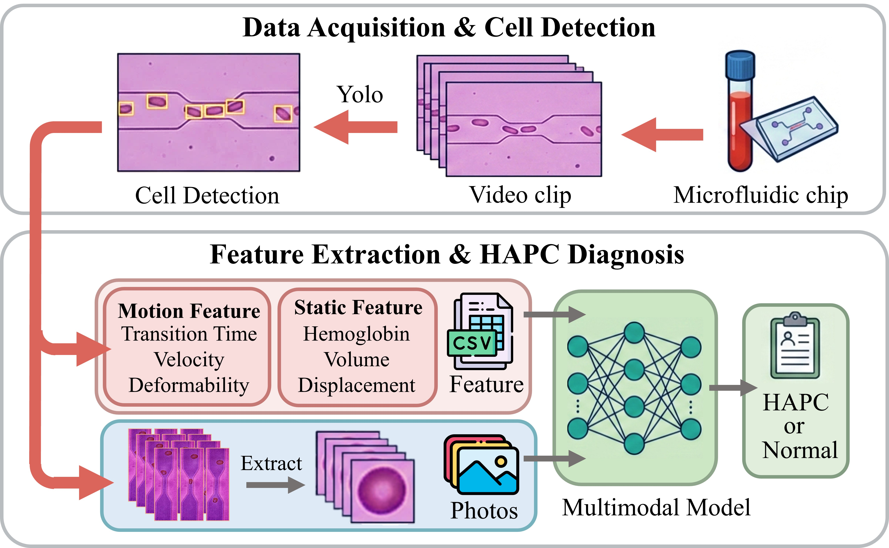
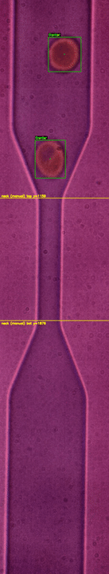
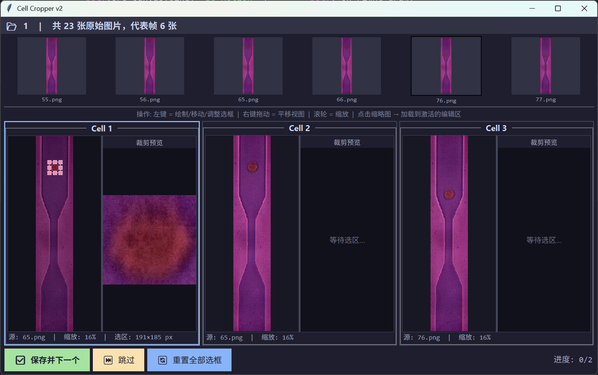

# Polycythemia Grading System

本项目面向红细胞增多症患者的早筛与精准分级。实验上通过高速相机拍摄红细胞通过微流控芯片窄颈区域的连续图像，代码侧从拍摄后的图像和视频中提取细胞通过窄颈时的动态生物力学特征、形态学特征，以及经过 SAM/MATLAB 流程得到的静态特征，最终用于区分正常人与不同严重程度的红细胞增多症患者。



## YOLO 识别效果

下面的动图由 `picture/yolo/channel_1_frame_*.jpg` 按帧号顺序生成，播放速度为 20 fps，即 1 秒展示 20 张识别结果。



## 项目结构

```text
Polycythemia_grading_system/
├── AutoLabel_for_yolo/          # YOLO 数据自动标注与人工修正
├── yolo/                        # YOLO 训练、视频检测、轨迹分析、YOLO 后分割
├── classification_after_yolo/   # YOLO 后的基准细胞手动选择与 SAM 精分割
├── static_feature_extraction/   # 静态细胞分割、整理、MATLAB 输入结构生成
├── matlab/                      # MATLAB 特征提取脚本
├── analysis/                    # 多模态模型、UMAP、细胞分级分析
├── picture/                     # README 与论文展示图片
└── README.md
```

## 总体流程

1. 使用 `AutoLabel_for_yolo` 为高速相机图像自动生成 YOLO 标签。自动标注失败或边界不可靠的图像，用人工标注工具补充修正。
2. 使用 `yolo/yolomodel.py` 训练 YOLO 模型，使用 `yolo/analysis_after_yolo.py` 对视频逐帧识别、追踪细胞，并提取通过窄颈区域时的动态特征。
3. 使用 `classification_after_yolo` 或 `yolo/segmentation_after_yolo.py` 为每个轨迹选择基准细胞，并基于模板匹配 + SAM 提取同一细胞在多帧中的精细分割结果。
4. 使用 `static_feature_extraction/2to5_process.py` 整理为 MATLAB 需要的数据结构，或对静态细胞数据先运行 `1_SAM.py` 再运行 `2to5_process.py`。
5. 使用 `matlab/` 中脚本提取体积、血红蛋白含量等静态特征。
6. 使用 `analysis/` 中三条分析流完成患者级、细胞级和多模态区分。

## AutoLabel_for_yolo

该目录用于把原始图像自动转成 YOLO 训练标签，并提供人工修正工具。推荐的数据结构是每个样本目录下放置 `images/`，脚本输出 `labels/`、`visualization/` 和 `summary.csv`。

```bash
python AutoLabel_for_yolo/auto_label.py /path/to/sample
python AutoLabel_for_yolo/auto_label.py /path/to/parent --batch
```

### 自动 neck 定位

`neck_detect.py` 用于定位微流控芯片中的窄颈区域，并返回 `neck_top` 与 `neck_bottom`。

1. 先识别并修复图像中可能已经存在的黄色、青色、白色可视化标注，避免二次处理时把文字或线条当成通道壁。
2. 将图像转到 LAB 空间，在 LAB-L 亮度通道上计算水平方向 Sobel 梯度。通道壁在图像中是近似竖直边缘，因此会表现为强水平梯度。
3. 对每一行分别在左半区寻找最强负梯度作为左壁，在右半区寻找最强正梯度作为右壁，并用行内噪声阈值过滤不可靠行。
4. 沿 Y 方向对左右壁位置做 median filter，降低细胞、阴影和局部反光造成的异常点。
5. 根据 `right - left` 得到每一行的通道宽度，使用宽度接近最小值的连续区域作为窄颈区。
6. 若有效壁面行太少或窄颈区不稳定，则使用图像高度中部的 fallback 区间，保证自动标注流程不中断。

如果自动 neck 不可靠，可以运行 `set_neck.py` 手动点击上下两条 neck 基线。脚本会写入样本目录下的 `neck.json`，`auto_label.py` 会优先使用该人工 neck。

```bash
python AutoLabel_for_yolo/set_neck.py /path/to/sample --scale 0.5
```

### 自动细胞检测算法

`cell_detect.py` 是自动标注的核心检测模块。它不是直接调用深度学习模型，而是利用微流控图像的颜色、位置和形态先验来获得稳定的单细胞 bbox。

1. 输入图像预处理  
   若图像中已经带有黄色 neck 线、青色标签或白色文字，脚本会先检测这些高亮标注区域，并用 OpenCV inpaint 修复。这样可以避免标注像素在 LAB-B 通道中被误认为红细胞。

2. LAB-B 阈值分割  
   图像转到 LAB 色彩空间后，使用 B 通道突出红细胞与背景之间的颜色差异。阈值取 `percentile(B, b_percentile)` 和 `mean(B) + 1.2 * std(B)` 的较大值，生成初始候选 mask。默认 `b_percentile=95.0`，可通过命令行调整。

3. 通道内部约束  
   `auto_label.py` 会把 `neck_detect.py` 返回的左右壁曲线转成 channel interior mask。细胞候选 mask 会先与通道内部 mask 相交，只保留微流控通道内的目标，从源头减少通道外反光、壁面噪声和标注残留。

4. 形态学清理  
   使用椭圆核开运算去除小噪点，闭运算连接断裂区域；随后使用竖向窄核闭运算修复运动模糊造成的上下断裂。这个竖向核专门针对高速流动下红细胞被拉成长条、局部信号中断的情况。

5. 孔洞填充  
   红细胞的双凹结构可能导致中心区域较暗，直接连通域会低估面积或产生空洞。脚本使用 flood fill 填充内部孔洞，使后续面积、fill ratio 和 solidity 计算更稳定。

6. 连通域与形状指标  
   对候选 mask 做 connected components，按图像面积比例过滤过小或过大的区域。每个候选会计算 `bbox`、`centroid`、`area`、`solidity`、`fill_ratio`、`aspect_ratio` 等指标，并按长宽比、填充率和凸包实心度过滤。

7. neck 区域自适应阈值  
   细胞进入窄颈时会被挤压、拉伸或折叠，因此窄颈附近使用更宽松的 `aspect_ratio` 和 `fill_ratio` 阈值。判断不是只看质心，而是看 bbox 是否与 neck 及其上方缓冲区重叠。

8. 运动模糊碎片合并  
   对同一条竖直运动轨迹上被短暂信号低谷切开的碎片，脚本会判断两个碎片是否水平重叠、垂直间隔很小，且单独看不像完整细胞。如果满足条件，就合并 mask 并重新计算形态指标。

9. watershed 拆分粘连细胞  
   对面积偏大、fill ratio 偏低或 solidity 偏低的候选，脚本使用 distance transform 寻找中心峰，再用 watershed 尝试拆分重叠或粘连细胞。拆分结果还会经过面积和形状复核，避免把一个不规则单细胞过度拆开。

10. NMS 去重  
    最后使用 non-maximum suppression 删除重复框或被大框包含的小框，保留面积更合理的候选，输出稳定的单细胞 bbox。

### YOLO 类别生成规则

`auto_label.py` 会根据细胞 bbox 与 neck 的相对位置生成 YOLO 标签：

| 类别 | 名称 | 判定规则 | 含义 |
| --- | --- | --- | --- |
| `0` | `enter` | bbox bottom 在 `neck_top` 上方 | 细胞尚未进入窄颈 |
| `1` | `in` | bbox 与 neck 区域有重叠 | 细胞正在窄颈中或正在跨越边界 |
| `2` | `exit` | bbox top 到达或超过 `neck_bottom` | 细胞已经离开窄颈 |

如果 bbox 跨越 `neck_top` 或 `neck_bottom`，脚本仍按上述规则写入 YOLO 类别，但会在 visualization 和 `summary.csv` 中标记为 transition，提示后续人工复核。

输出文件包括：

```text
sample/
├── images/
├── labels/              # YOLO txt: class cx cy w h
├── visualization/       # neck 线、bbox、类别和 transition 可视化
├── summary.csv          # 每张图的检测统计
└── neck.json            # 可选，人工 neck 设置
```

### 人工标注与修正

`hand_label.py` 是基于 SAM 的交互式人工标注工具，适合处理自动标注失败、细胞重叠严重或边界异常的图像。

- 鼠标悬停时调用 SAM 预览细胞轮廓。
- 左键确认当前细胞，右键撤销上一个标注。
- `0/1/2` 切换进入、窄颈中、离开三个类别。
- Enter 保存当前图像的 YOLO 标签与可视化结果。
- Esc 保存断点，下次从当前图像继续。



## yolo

`yolo/yolomodel.py` 使用 Ultralytics YOLOv8n 训练三分类检测模型。当前脚本中数据集路径、预训练权重路径、图像尺寸、batch、epochs 等参数写在代码内，复现实验时需要根据本机环境修改。

`yolo/analysis_after_yolo.py` 用训练好的模型处理视频：

1. 读取视频并可交互选择中部窄颈 ROI。
2. 对每帧运行 YOLO，保留 `enter/in/exit` 三类检测结果。
3. 通过相邻帧中心距离进行轨迹匹配，形成单细胞 track。
4. 只保留在 `IRBC` 状态持续帧数达到阈值的有效轨迹。
5. 计算每条轨迹的 transition time、总位移、速度、面积、置信度、deformation index 等特征。
6. 输出 `irbc_summary.csv`、`irbc_details.csv`，并保存轨迹相关的原图和标注图，供后续基准细胞选择与 SAM 分割使用。

`yolo/segmentation_after_yolo.py` 和 `yolo/for_classification.py` 用于把 YOLO 后筛选出的轨迹图像进一步整理和分割。它们会读取指定轨迹 ID，复制对应文件夹，并基于 `cell1/cell2/cell3` 模板、模板匹配和 SAM 生成 `matlabphotos2-seg` 结构。

## classification_after_yolo

该目录用于 YOLO 轨迹之后的基准细胞选择和精细化单细胞分割。

### 手动选取基准细胞

`cell_pickup_for_segmentaion.py` 是交互式裁剪工具。每个样本目录中，它会从首段、中段、末段各选代表图，共展示最多 6 张图，辅助人工判断同一细胞在序列中的典型形态。

工具支持：

- 缩放和平移图像。
- 用鼠标框选、移动、调整裁剪框。
- 实时预览裁剪结果。
- 保存 `cell1.png`、`cell2.png`、`cell3.png` 三个基准细胞。
- 已保存的样本会自动跳过，方便批量补标。

### `sam_after_yolo.py`: 基于基准细胞的一致性追踪分割

`sam_after_yolo.py` 当前版本使用每个 patient/track 目录下的单个 `cell.png` 作为基准细胞模板，用它在同一序列的其他图像中定位并分割同一个细胞。它与 `cell_pickup_for_segmentaion.py` 的三模板流程可以配合使用，但需要注意当前脚本读取的是 `cell.png`，而不是 `cell1.png/cell2.png/cell3.png`。

处理逻辑如下：

1. 输入与排序  
   每个目录需要一个人工选出的 `cell.png`。脚本会忽略所有以 `cell` 开头的图片，只处理其他图像，并从文件名中提取数字做自然排序，保证同一细胞序列按时间顺序处理。

2. 基准细胞特征提取  
   对 `cell.png` 做灰度 Otsu 分割，自动判断前景/背景方向，并用形态学开闭运算清理模板 mask。随后计算模板像素面积、中心区域 HSV 直方图和 solidity。面积用于判断后续 mask 大小是否合理，颜色直方图用于判断是否分割到了同一类细胞，solidity 用于衡量模板形态完整性。

3. 两阶段模板定位  
   对每张待处理图像，脚本先在灰度图上做多尺度模板匹配，尺度范围默认 `0.5-2.0`，步数默认 `30`。如果灰度匹配分数未达到阈值，则再对图像和模板做 Canny 边缘提取，用边缘模板匹配处理运动模糊、亮度变化或细胞内部纹理变化。若强匹配失败，但最佳结果达到较低弱阈值，也会作为候选继续处理。

4. 构造 SAM prompt  
   模板定位会返回细胞中心、最佳缩放比例、匹配分数和匹配框大小。脚本据此构造一个放大的 box prompt，并生成 9 个前景点：1 个中心点加 8 个环形点。box prompt 限制 SAM 的搜索范围，避免选中整条通道；多点 prompt 告诉 SAM 这些点属于同一个细胞，降低折叠、变形或颜色不均导致的半细胞分割。

5. 多候选 mask 后处理  
   SAM 使用 `multimask_output=True` 输出多个候选 mask。每个候选先经过形态学闭运算填小孔、开运算去噪，再只保留最大连通域，去掉远处碎片。若后处理后的 solidity 低于 `0.90`，脚本会使用凸包填充，修复折叠细胞或双凹结构被 SAM 切掉的凹陷区域。

6. 候选 mask 筛选  
   脚本根据模板面积和匹配尺度估计期望面积 `template_area * scale^2`，再检查候选 mask 的面积比是否在容忍范围内、solidity 是否达标、长宽比是否过大、mask 面积是否异常超过 prompt box、中心区域颜色直方图是否接近模板。

7. 综合评分选择最佳 mask  
   通过筛选的候选会计算综合分：solidity、面积接近度、SAM score、颜色相似度、box 紧致度共同决定最终结果。这样可以避免只相信 SAM score，因为最高 SAM score 有时会对应背景、通道壁或多个细胞粘连区域。

8. 失败重试  
   若第一轮没有找到合格 mask，脚本会把 box prompt 从 `1.5` 倍扩大到 `2.0` 倍，并放宽面积容忍度、solidity 和长宽比阈值重试。这个策略用于处理运动模糊、严重折叠、细胞变形或首轮定位框偏小的困难帧。

9. 保存结果  
   成功后，脚本用 mask 从原图裁剪单细胞区域，并按原始长宽比缩放到 `224 x 224` 黑底画布。输出文件名包含原图名、bbox 坐标和 mask area，例如：

```text
frameName_xmin_ymin_xmax_ymax_maskArea.tif
```

这种命名方式能在后续 MATLAB 和静态特征流程中追踪每个单细胞图像的来源、位置和分割面积。脚本支持单个 patient 目录和批量目录处理，缺少 `cell.png` 的目录会跳过并写入 `error.txt`。

## static_feature_extraction

该目录负责把分割后的单细胞图像整理为 MATLAB 特征提取所需结构。目录内文件名已经和流程绑定，不建议修改。

两种使用方式：

1. YOLO 后处理数据  
   当已经有 `matlabphotos2` 和 `matlabphotos2-seg` 时，修改 `2to5_process.py` 中的 `BASE_ROOT`，运行后可自动串联：

```text
2_cla3.py -> 3_add_background.py -> 4_mask.py -> 5_for_matlab.py
```

2. 静态细胞数据  
   如果细胞不是注射器推动的流动状态，而是静态拍摄，可以先运行 `1_SAM.py` 得到初始分割，再运行 `2to5_process.py` 生成 MATLAB 输入结构。

子目录结构说明见 `static_feature_extraction/readme.md`。

## matlab

`matlab/Batch_processing.m` 和 `matlab/stiffness_full_final_with_fitting_fft_edited.m` 用于批量读取整理后的单细胞序列，并提取静态特征，例如体积、血红蛋白含量、RMS displacement 等。生成的表格特征会和 YOLO 轨迹特征一起进入下游分析。

## analysis

`analysis` 中包含三条分析流。

### 多模态训练分析

`analysis/multimodel/train.py` 训练图像 + 表格特征融合模型：

- 图像分支使用 ResNet18。
- 表格分支使用体积、HGB Mean、RMS displacement、面积、速度、DI、TransitionTime 等特征。
- 使用交叉验证评估模型，并保存学习曲线、ROC、Grad-CAM 和模型权重。

`analysis/multimodel/multimodel_for_feature.py` 读取训练好的多模态模型，提取融合特征，并用 SVM/PCA 可视化患者和疾病类别分离效果。

### UMAP 无训练分析

`analysis/UMAP/UMAP_analysis.py` 不训练新的分类模型。它使用 ImageNet 预训练 ResNet 提取图像特征，同时读取表格特征，再通过 concat、CCA 或 SNF 融合，使用 UMAP 或 PCA 降维，并进行聚类、严重程度可视化和消融分析。

### 细胞分级组成分析

`analysis/cell_classification/rbc_classification.py` 从细胞级特征出发，使用 LDA 将细胞划分为：

- `Normal-like`
- `Mildly Abnormal`
- `Moderately Abnormal`
- `Severely Abnormal`

随后统计不同患者、不同疾病阶段中各类细胞的比例，绘制 PCA/LDA 分布、雷达图、堆叠柱状图、热图、病理指数和 ridge plot，用于观察患者间异质性和疾病进展趋势。

## 注意事项

- 多个脚本中的数据路径、模型路径和输出路径目前写在代码顶部，复现实验前需要按本机目录修改。
- SAM checkpoint、YOLO weight、原始视频和临床表格数据没有包含在仓库中，需要单独准备。
- `picture/AutoLabel_after_yolo` 截图当前仓库中不存在，因此 README 暂不引用；后续补充图片后可以加入到 `classification_after_yolo` 小节。
- 根目录 README 只描述整体流程；具体数据结构以各子模块代码和 `static_feature_extraction/readme.md` 为准。
